### Compléments, astuces
A) Pour éviter des problèmes de compilation, le mieux est que **le dossier Marlin soit au plus proche de la racine du disque** :

Exemple: C:\Marlin plutôt que dans le dossier perso de l'utilisateur (_**éviter les signes diacritiques (caractères accentués) et/ou espaces dans le chemin d'accès à ce dossier**_)

B) J'ai une erreur du type : «*VSC me demande de mettre à jour les includepath*»

C'est fréquent avec VSC. La base de données (Intellisense) n'est pas toujours à jour, la plupart du temps ça n'empêche pas la compilation. Il suffit parfois d'attendre quelques minutes pour que cette erreur disparaisse sinon une fermeture de VSC puis une réouverture permet parfois de tout faire rentrer dans l'ordre.
*Voir également le point D/3 plus bas*

C) La compilation (rappel) :

**Via Platformio IDE :**
1) Dans l'onglet «PIO Home», «Open Project» :

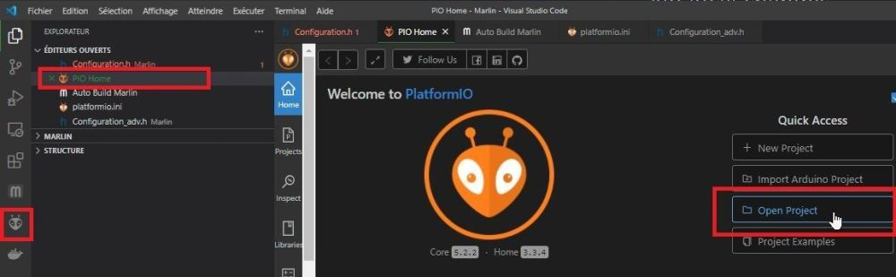

2) Via l'explorateur de fichiers, sélectionner le dossier contenant à la fois le fichier platformio.ini et le dossier Marlin, clic sur «Open "nom-du-dossier-sélectionné" puis confirmation en cliquant «OUI» :

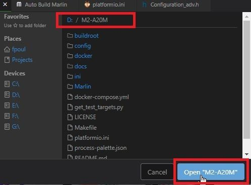
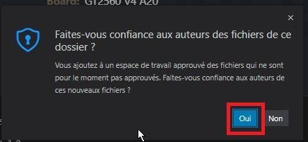
	
3) Lancer la compilation en cliquant sur le coche en bas de la fenêtre :

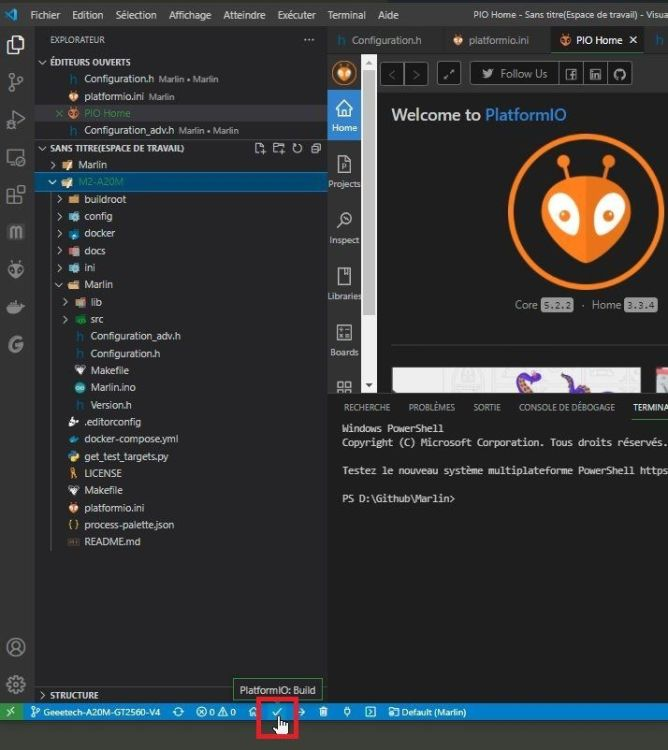	

4) Si / quand la compilation est réussie ET que l'imprimante est reliée à l'ordinateur, on peut téléverser le firmware dans la carte (clic sur «flèche droite»)

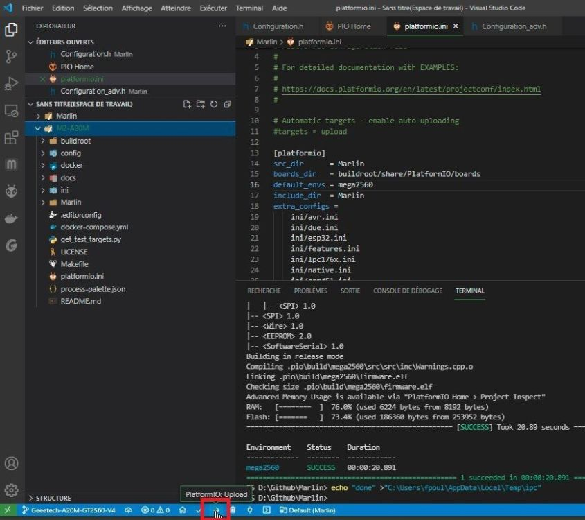

PS: **ça ne fonctionne qu'avec les cartes 8 bits (Atmega1284, Atmega2560)**. Avec des cartes 32 bits à base de STM ou LPC, la procédure de flashage consiste à recopier le fichier en .bin du dossier .pio/build/STM??? (LPC???) sur une carte SD (moins de 32Go, formatée FAT32 secteurs de 4Ko) et allumer l'imprimante pour lancer le flash.

**Via Auto Build Marlin (ABM) :**
1) Compiler le firmware en sélectionnant le greffon ABM. puis l'icone «Marteau» :

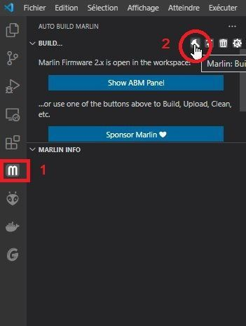

Pendant que la compilation se réalise :

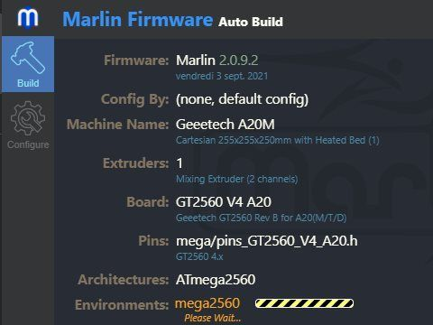

2) Une fois la compilation terminée, si l'imprimante est connectée à l'ordinateur, téléverser le firmware (clic sur «Upload»). Attention, même remarque que pour Platformio (plus haut) :

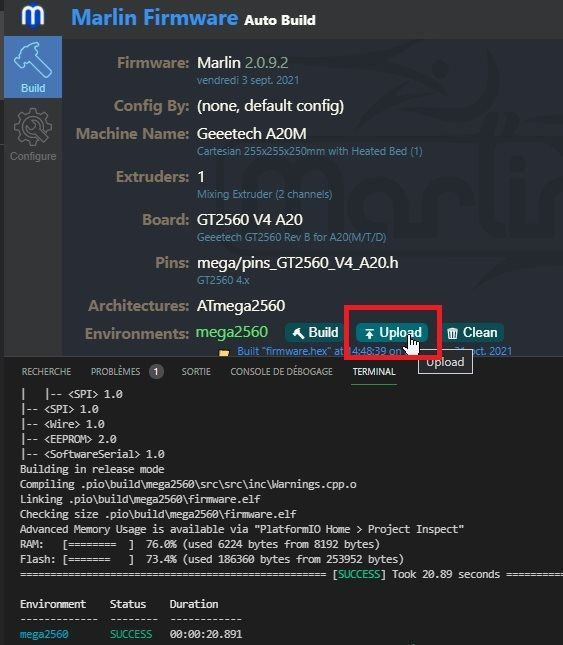

 D) Éventuellement, appliquer la suite de manipulations ci-dessous quand ça ne fonctionne pas comme attendu. Parfois cela résout le problème. *Si le système d'exploitation est **Windows**, un redémarrage est souvent salutaire*.

 A effectuer étape par étape. Après chaque étape, retenter une compilation:

 1) Nettoyer le cache de Platformio (Pio pour les «intimes» 😄 ) :
 
 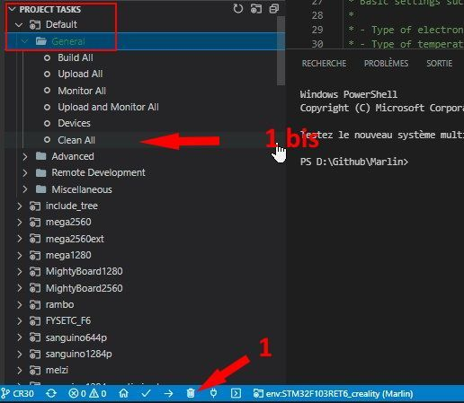
 
2) Si la compilation pose toujours problème, sortir l'artillerie lourde :

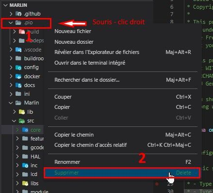

3) Sans rapport mais utile pour les problèmes «Intellisense» :

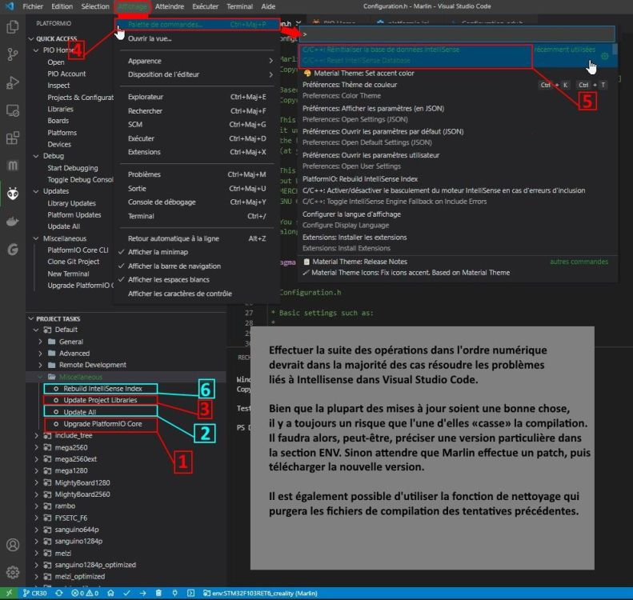

 E) Problèmes spécifiques Windows / Platformio:

Parfois, Platformio rencontre des problèmes avec Python. C'est généralement Windows (10 / 11) qui en est la cause, particulièrement la gestion des alias d'applications :

Il suffit de désactiver les alias d'exécution d'application de W10.

Zone recherche de «Windows» taper Alias puis sélectionner «Gérer les alias d'exécution d'application» (plus d'infos en anglais) : 

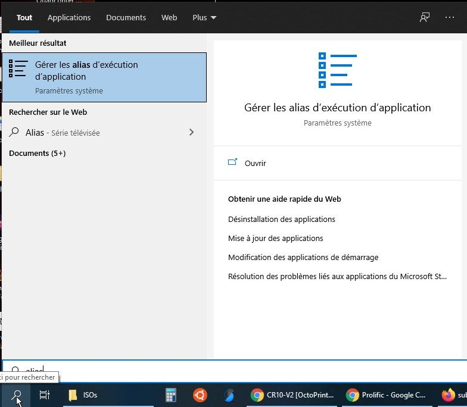

Dans la fenêtre qui s'ouvre, désactiver les alias pour toutes les versions de Python qui seraient installées, relancer la procédure  d'installation de l'extension Platformio dans VSC. 

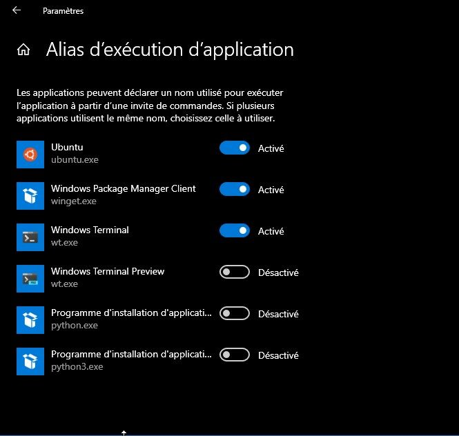
