En préliminaire, ce document n'est que la description de ma méthode de travail pour préparer un firmware basé sur Marlin. D'autres méthodes existent, l'important est de trouver celle qui vous sied le plus.

Ce tutoriel ne s'adresse pas dans un premier temps à de purs débutants. Toutefois, en acceptant de s'y mettre et en faisant vos propres essais / erreurs (principe de tout apprentissage) la réussite peut être en vue (la courbe d'apprentissage n'est pas extrêmement pentue mais la route qui y mène n'est pas aussi droite comme l'avait judicieusement remarqué J.-P. Raffarin en son temps).

# AU COMMENCEMENT

Quand j’ai commencé à préparer mes propres firmwares pour mes imprimantes, je reproduisais la méthode décrite dans bon nombre de tutoriels (écrits ou vidéos) : je récupérais le fichier compressé de la version de Marlin sur laquelle je me basais pour faire mes modifications (platformio.ini, configuration.h et configuration_adv.h. 

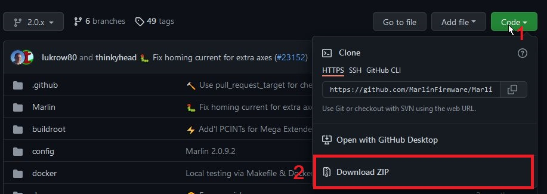

Si parmi les [exemples de modèles fournis par l’équipe du Marlin](https://github.com/MarlinFirmware/Marlin/tree/2.0.x/config) existait l’imprimante à préparer, la tâche était facilitée :

1. copier les configuration.h et configuration_adv.h (et éventuellement s’ils étaient également fournis, _Statusscreen.h et _Bootscreen.h) puis les coller dans le dossier Marlin en remplacement de ceux par défaut.
2. ensuite l’étape de compilation
  * correction des erreurs,
  * retour à l’étape 2 (compilation)
3. finalement la compilation étant réussie alors dernière étape, flasher le firmware.

Si une nouvelle version stable de Marlin était disponible, il fallait répéter les étapes précédentes depuis la récupération du Marlin compressé jusqu’au flashage.

La gestion des différences entre les fichiers de configurations pouvait être facilitée par l’utilisation de [Winmerge](https://winmerge.org/) (ou [Notepad++](https://notepad-plus-plus.org/) et l’ajout d’[un greffon](https://github.com/pnedev/compare-plugin) ou encore avec [Visual Studio Code](https://code.visualstudio.com/) ).

S’il fallait préparer des versions différentes de firmware (modèle d’imprimante différent, variation de carte mère, présence d’un ABL, type d’ABL, détection de fin de filament, …) alors il était nécessaire d’organiser les dossiers, de les nommer correctement sinon le troisième élément de la trilogie : **hardware, software … foutoir** ne tardait pas à surgir (loi de Murphy oblige).

En gros c’était pour le moins fastidieux et nécessitait une bonne organisation 😉 De plus ça finissait par occuper de la place sur l’unité de stockage.

En résumé :

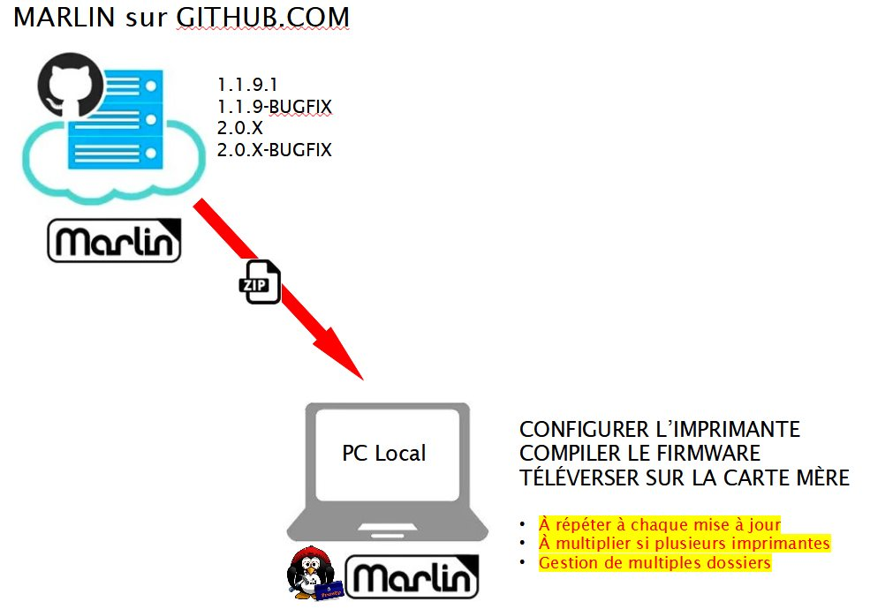

## Un outil de gestion de versions : GIT

C’est là que j’ai découvert qu’on pouvait «bénéficier» d’outils de gestion de versions : [Git](https://git-scm.com/) (son créateur n’est autre que Linus Torvald également connu pour avoir au milieu des années 1990 développé le système Linux).

Pour aller plus loin dans l’utilisation de GIT :

- https://www.mcorbin.fr/posts/2020-06-26-git-introduction/

- https://rogerdudler.github.io/git-guide/index.fr.html

- [un cours assez complet](https://www.pierre-giraud.com/git-github-apprendre-cours/)

- [la cheat sheet](https://training.github.com/downloads/fr/github-git-cheat-sheet/) [(PDF)](https://training.github.com/downloads/fr/github-git-cheat-sheet.pdf)

Git est pratique pour travailler localement mais pour pouvoir diffuser, modifier et faire bénéficier d’autres utilisateurs de ce travail, un système distant comme [github](https://github.com/) augmente les possibilités.

Utiliser github.com (*ou gitlab si Microsoft vous hérisse le poil*) nécessite la création d’un compte uniquement si vous voulez créer vos propres dépôts.

[Créer son compte Github](https://github.com/pricing) (gratuit) en cliquant sur «Create a free orgaization» : 

Un [formulaire](https://github.com/account/organizations/new?plan=free&ref_cta=Create%2520an%2520organization&ref_loc=pricing%2520comparison&ref_page=%2Fpricing) s’affiche qu’il suffit de compléter : 

Ne pas oublier la [phase de vérification de l’email](https://docs.github.com/en/get-started/signing-up-for-github/verifying-your-email-address) saisi lors de la création du compte.

Quelques termes à connaître, le [glossaire github](https://docs.github.com/en/get-started/quickstart/github-glossary) (en anglais)

Une fois le compte créé et validé, on peut créer ses propres dépôts directement en ligne ou en local sur son ordinateur (ligne de commandes).

Cependant un logiciel très pratique permet de faciliter les différentes tâches : [Github Desktop](https://desktop.github.com/) (raccourci en GD pour la suite) interface en anglais uniquement et pas de version pour les linuxiens 😞 .

Télécharger puis installer GD via le lien précédent. Ce logiciel utilisera vos identifiants (pseudo / mot de passe) pour se souvenir de qui vous êtes, ils vous seront demandés à la fin de l’installation.

Pour une documentation malheureusement uniquement en anglais, consulter [ce lien](https://docs.github.com/en/desktop).

## Ma méthode de travail avec Marlin

En ligne, sur le dépôt github de Marlin, en étant connecté avec votre compte, on va réaliser un «fork» du projet originel (Marlin) (=copie préservant les liens vers le dépôt originel): aller sur https://github.com/MarlinFirmware/Marlin

Cliquer sur le bouton FORK : 

 

 Vous venez de créer une copie identique du dépôt Marlin dans votre compte github précédemment créé

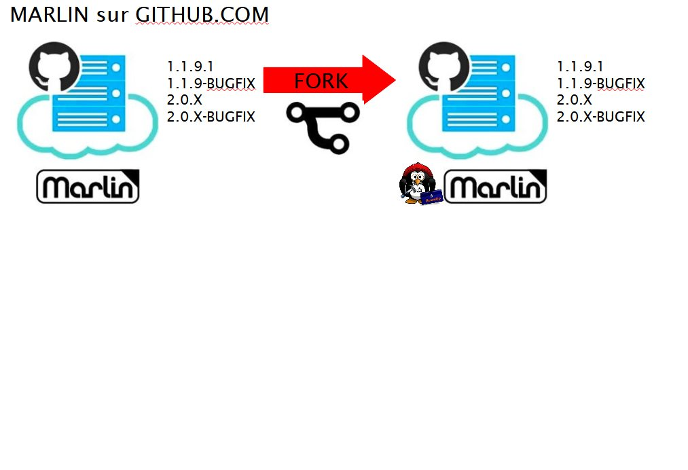 

Votre dépôt distant contient une copie exacte y compris toutes les branches (variantes) du Marlin originel. Désormais, le dépôt Marlin originel sera dénommé «***UPSTREAM***», la version de votre dépôt, elle, sera appelée «***ORIGIN***».

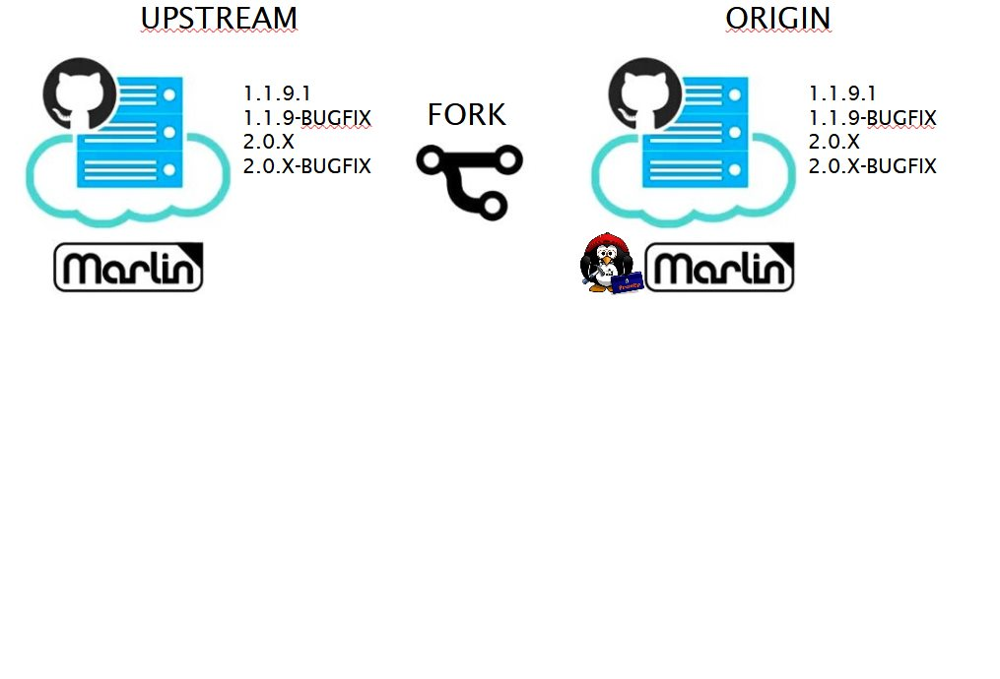 

**Le fork pour le moment n’est présent que dans notre dépôt Github**. Pour réaliser les modifications des fichiers de configuration de Marlin, je trouve plus pratique de travailler en local sur son propre ordinateur. On va donc récupérer le contenu de notre dépôt distant.

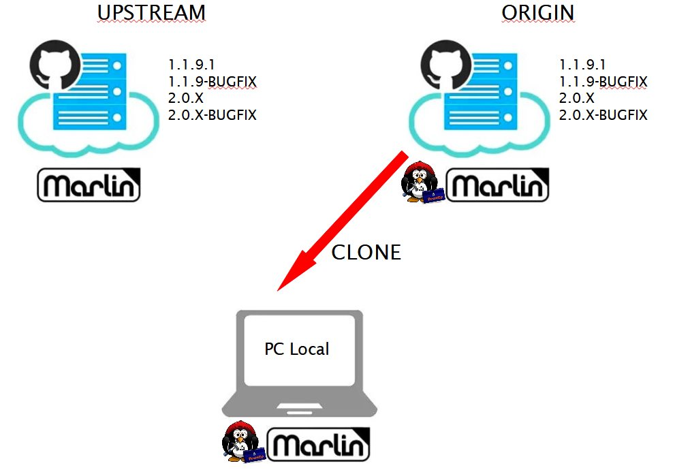 

Ayant pris depuis longtemps l’habitude d’organiser et regrouper mes dossiers / répertoires sur mes disques durs (ça facilite les sauvegardes 😉 )  
=> création d’un nouveau répertoire sur une unité de stockage pour accueillir nos futurs «*développements*» ( C:\GITHUB par exemple ) 

### Première option :

Via le site github.com de notre dépôt (notre compte), clic sur le bouton «**Code**» puis => *Open with Github Desktop*

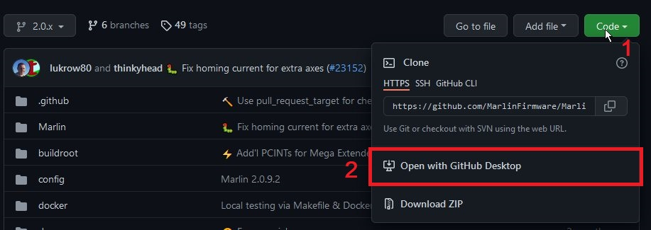 

### Seconde option :

Via GD, menu principal, «*Clone repository…*»

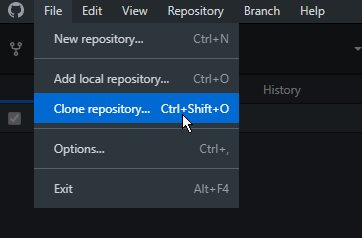 

Saisir l’URL du dépôt à cloner (notre «ORIGIN») dans l’onglet URL, modifier éventuellement le chemin d’accès (Local path) pour correspondre au lieu de stockage prévu puis clic «Clone»

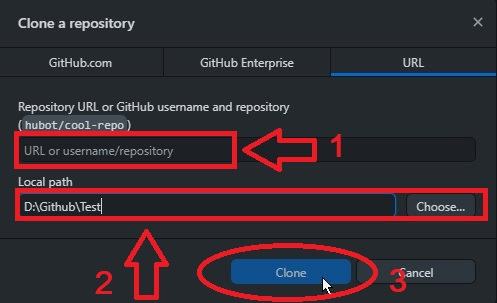 

Une barre de progression signale le transfert en cours. A la fin du processus de copie en local, on nous demande comment on souhaite contribuer au développement du dépôt cloné (contribuer au projet parent ou pour son propre usage). Si par exemple on pense proposer des corrections / modifications au projet originel (pull request), il est préférable d’indiquer que l’on contribuera au projet parent.

Que ce soit avec la première option ou la seconde, toutes les branches du dépôt cloné sont maintenant accessibles sur notre matériel local (origin/x,x,x). 

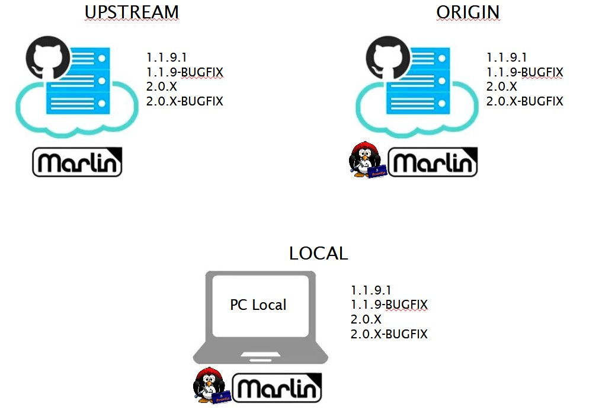 

Désormais, Github Desktop nous permet d’accéder à notre dépôt distant:
* View on Github [1]),
* à notre emplacement local (Show in Explorer [2]),
* et également d’utiliser notre éditeur de code (VSC) en cliquant (Open in visual Studio Code [3]) ( *il est évidemment possible d’indiquer un autre éditeur que VSC via les préférences du logiciel ou en cliquant «options»* (4).

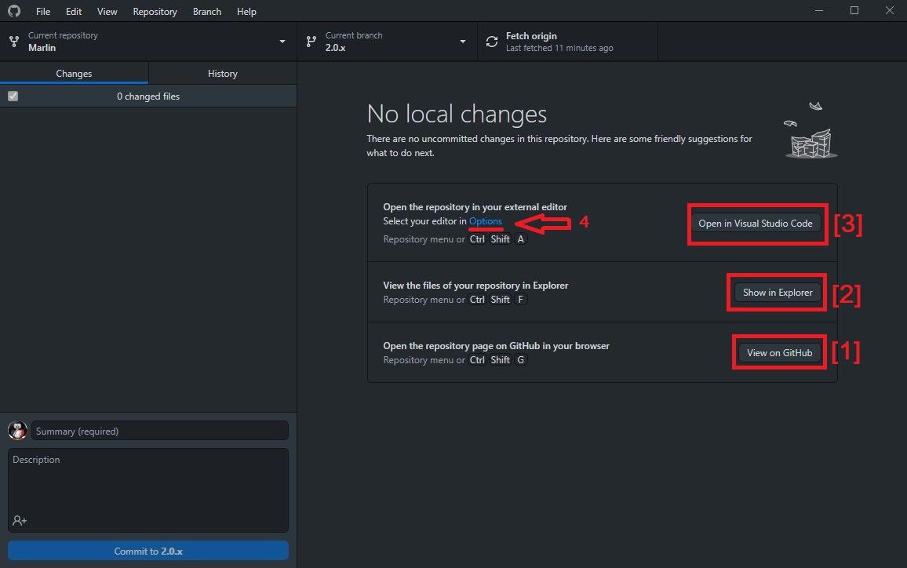 

## Création d’une nouvelle branche locale

Je souhaite créer un firmware basé sur la version stable de Marlin pour une nouvelle imprimante :

* Choix de la branche (version) qui servira de base (Current branch)

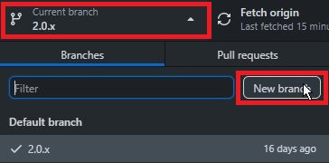 

* nommer cette branche puis clic sur «Create branch»

 

La branche est désormais créée sur notre disque **localement** :

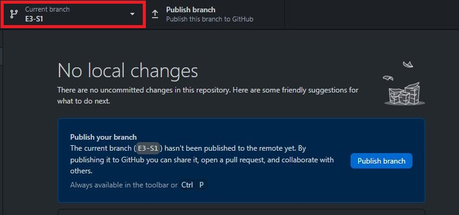 

On peut maintenant via notre éditeur (VSC) faire toutes les modifications manuellement dans les fichiers ***configuration.h*** et ***configuration_adv.h*** ou quand le modèle d’imprimante dispose de fichiers exemples fournis par l’équipe de Marlin, recopier les fichiers nécessaires en remplacement de ceux du clonage.

Les modifications seront automatiquement détectées dans GD 😉

* détection des changements dans GD

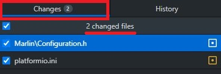 

* le contenu des modifications est précisé (history), rouge / vert avant / après modifications :

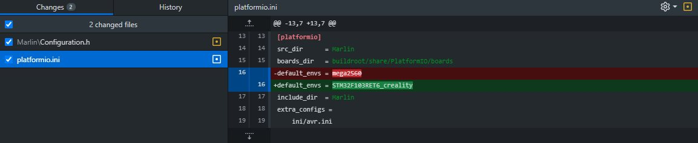 

Pour le moment, toutes ces modifications n’existent qu’au niveau local, il reste à synchroniser avec github => Publish branch 

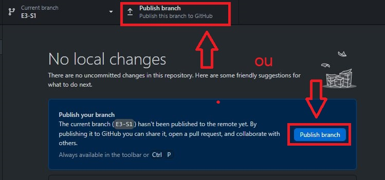 

