# Comment installer Octoprint sur un Orange Pi Zero 2 (aka OPiz2)

## En préambule :

Octoprint, permet :
- le suivi de l'impression de l'imprimante 3D (de n'importe où, sur votre smartphone par exemple),
- l’envoi de fichier à imprimer sans avoir à quitter votre ordinateur
- l’allumage/extinction de l'imprimante à distance
- la prévisualisation du modèle à imprimer
- la création de timelapses à partir de vos impressions.
- en option, la réception d’une alerte si l'imprimante commence à imprimer des spaghettis.

Octoprint est un logiciel serveur HTTP, écrit en langage Python, censé fonctionner sur un petit ordinateur.

La majorité du temps, il est installé sur un Raspberry Pi (un RPi0 v2 ou RPi3 étant le minimum requis) en téléchargeant une image pré-construite (OctoPi) ou encore manuellement via des commandes à exécuter après l’installation d’une image système minimale (Raspberry OS Lite précédemment nommée Raspbian).

Cela signifie de se procurer un Raspberry Pi, un boîtier (on peut en imprimer un, ce ne sont pas les modèles qui manquent), probablement une caméra (Webcam / Raspicam) également, tout ceci, aujourd’hui n'est pas bon marché. En temps normal, il vous en coûterait environ 50€ (RPi3 ou RPi4) ou une vingtaine d’euros pour une RpiO V2 auxquels il faudrait ajouter le prix de la Webcam ou RaspiCam sans oublier une bonne alimentation **5,1V/3A**.

Vous n’êtes pas sans savoir ou alors vous êtes encore terré dans votre grotte depuis mars 2020 qu’une pénurie de composants affecte actuellement de nombreux secteurs. Réussir à se procurer aujourd’hui des cartes Raspberry Pi à des prix non stratosphériques relève de la gageure.

Régulièrement, je consulte le site [«RPiLocator» ](https://rpilocator.com/) pour connaître l’état des stocks ainsi que les prix.

La pénurie et/ou les prix pratiqués sont une des raisons pour laquelle on peut envisager se tourner vers d’autres cartes du même genre (OrangePi, BananaPi et autres variantes). La seconde raison et probablement la plus importante ayant conduit à la rédaction de ce tutoriel est la conséquence d’un dépannage pour un de mes partenaires modérateurs du forum [«Lesimprimantes3d.fr» ](https://www.lesimprimantes3d.fr/forum/). Grâce à lui, j’ai pu me faire la main sur une carte alternative au RaspberryPI : une OrangePI Zéro 2

La carte SBC (Single Board Computer) utilisée ici une [OrangePi Zero 2](https://fr.aliexpress.com/item/1005001823662622.html?gatewayAdapt=glo2fra&pvid=1f8c2f19-6b28-4698-959b-c0074ada3e5b&_t=gps-id%3ApcDetailBottomMoreThisSeller%2Cscm-url%3A1007.13339.274681.0%2Cpvid%3A1f8c2f19-6b28-4698-959b-c0074ada3e5b%2Ctpp_buckets%3A668%232846%238112%231997&pdp_ext_f=%257B%2522sku_id%2522%253A%252212000017777234288%2522%252C%2522sceneId%2522%253A%25223339%2522%257D&pdp_pi=-1%253B28.3%253B-1%253B-1%2540salePrice%253BEUR%253Brecommend-recommend) :

\- son facteur de forme est plus petit que celui d’un RPi3/4,

\- tout aussi rapide,

\- moins chère (normalement une trentaine d’euros mais plutôt autour de 35/40€ à ce jour)

\- et surtout actuellement disponible.

Cette carte existe en deux versions : 512Mo / 1 Go de RAM (la différence de prix entre les deux n’est pas insurmontable).

Le CPU utilisé est un Allwinner H616 (CPU ARM 64bits).

ATTENTION : OrangePi fabrique de nombreuses cartes dont les noms sont parfois similaires mais dont les composants électroniques sont différents. Ne vous laissez donc pas tromper par toutes les autres cartes d'OrangePi (la Zero, la Zero+ ou encore la Zero+2).

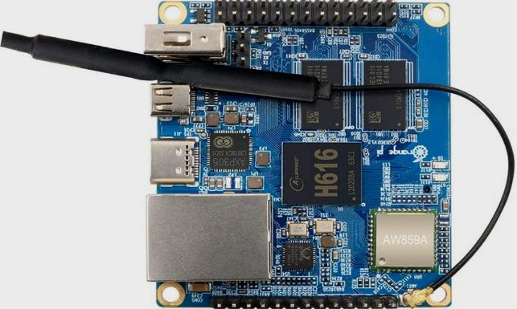

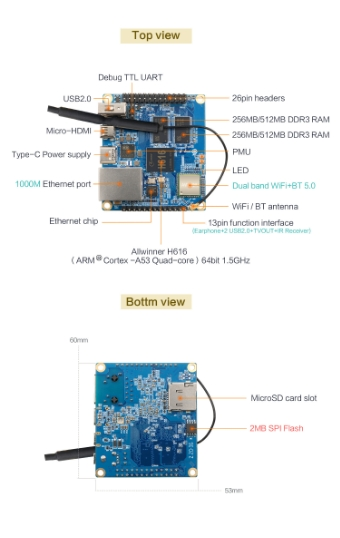

Cette carte peut fonctionner avec plusieurs systèmes d’exploitation : un [fourni par le fabricant ](http://www.orangepi.org/downloadresources/)de la carte (avec interface graphique) ou avec le[ système ](https://www.armbian.com/download/?device_support=Supported)[Armbian](https://www.armbian.com/download/?device_support=Supported) (image dépouillée d’interface graphique, semblable au système Raspberry OS Lite donc) basée sur la dernière version de Debian (Bullseye).

Récapitulatif du matériel :

\- carte OrangePi Zero 2 (nommée OPiz2 dans le reste du document)

\- alimentation 5V/2A,

\- un câble USB-C (seules les broches 5V et de masse sont utilisées, un câble de données n’est donc pas indispensable),

\- une carte µSD (8GB ou 16GB ou plus)

\- optionnel, une webcam

\- un HUB USB ou une [carte additionnelle à monter sur la OPiz2 ](https://www.aliexpress.com/item/32770665186.html?gatewayAdapt=glo2fra)car d’origine un seul port USB est implanté sur la carte

La voie avait déjà été débroussaillée par diverses lectures dont la principale, [ce sujet](https://blog.cyril.by/fr/3d-printers/installing-octoprint-on-orange-pi-zero-2) de Blog. N’ayant pas exactement suivi ce qui y est décrit, je relate ici ce que j’ai fait pour obtenir au final quelque chose de fonctionnel. En espérant que je n’aurai rien oublié et que les étapes suivies permettront à d’autres d’obtenir le même résultat.

## Installation

Le processus d'installation est assez simple, à condition que vous sachiez déjà comment utiliser Linux **a minima**. J’essaierai de détailler les différentes étapes.


### Préparation de la carte microSD

Contrairement à votre ordinateur, cette carte ne possède pas d’équivalent d’un BIOS pour démarrer. Le système d'exploitation doit être écrit sur une carte SD. Le système démarrera et fonctionnera à partir de cette carte µSD.

Une carte de 8GB ou plus est nécessaire. Plus la capacité de stockage de la carte est grande, moins elle risquera de manquer d'espace avec les mises à jour logicielles et moins elle risquera d’être endommagée par l'usure de la carte due aux écritures / réécritures sur celle-ci.

En l’occurrence, la carte μSD utilisée est une Sandisk Ultra de 16Go (classe 10 / A1).

Une fois la carte SD à disposition, télécharger l'image Armbian pour la carte OPiz2 à partir d'[ici](https://www.armbian.com/orange-pi-zero-2/) (le choix de votre méthode de téléchargement dépend de vos préférences (P2P ou direct)).

Le «gros» bouton vert [SUPPORTED] permet de savoir que cette image fonctionne avec cette carte ;-)

L’image utilisée sera celle basée sur une Debian (Bullseye), il en existe une seconde, basée sur Ubuntu (Focal) que je n’ai ni utilisée ni testée.

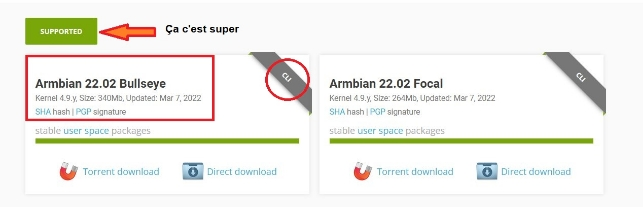

` `Vous devrez ensuite décompresser ce fichier avec le logiciel de décompression [7zip](https://www.7-zip.org/) (disponible pour Windows, Linux) ou avec [The Unarchiver (MacOS)](https://theunarchiver.com/). Les deux sont gratuits, seul 7Zip a été testé car je ne possède aucun équipement de la marque à la pomme.

Les utilisateurs de Linux devront installer «p7zip» (la version «terminal de 7zip).

Sur un système Debian/Ubuntu, ouvrir un terminal et saisir :

`sudo apt install p7zip`

Une fois p7zip installé, saisir dans le terminal la commande suivante pour extraire l’image :

`7zr x nom-de-l-image.7z`

Remplacer évidemment « nom-de-l-image» par le nom de l’archive téléchargée.

Une fois l'archive décompressée, vous obtiendrez un fichier .img. Celui-ci devra être gravé sur la carte SD.

### Flash de l’image

Le logiciel [BalenaEtcher](https://www.balena.io/etcher/) sera utilisé pour cette «gravure»:
\- choix du fichier .img

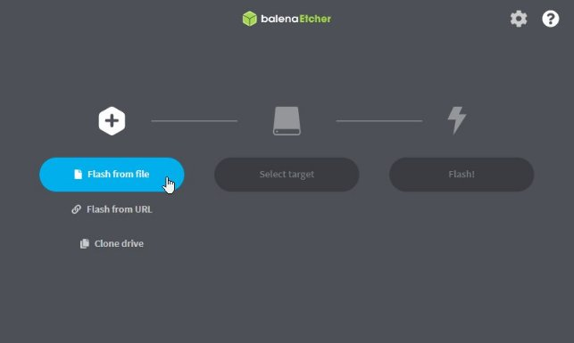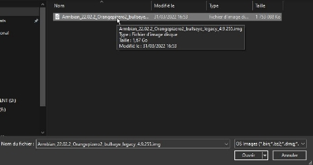

\- sélection du lecteur de carte µSD sur votre ordinateur (bien vérifier que la taille correspond à celle de votre carte SD,

**[ATTENTION] Toutes les données du disque choisi seront effacées ! La procédure de flashage effacera complètement le disque sélectionné, donc si vous choisissez le mauvais, vous risquez de perdre des données.**

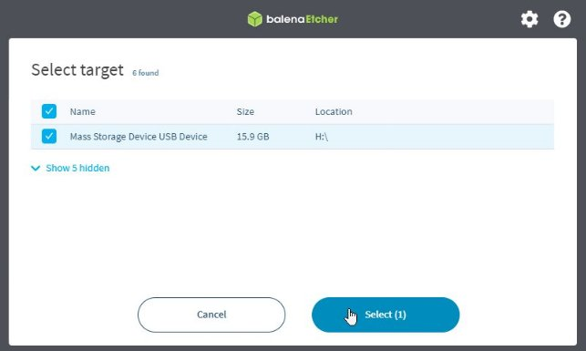

\- gravure de l'image (quelques minutes de patience)

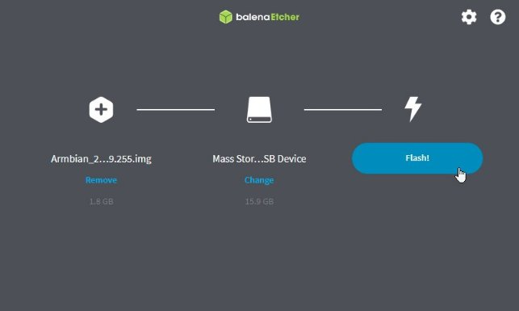

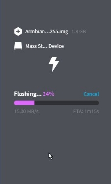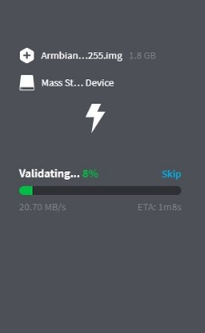

\- éjection de la carte de votre ordinateur

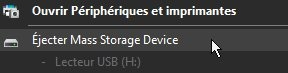

C’est fini pour cette étape !

**A noter** : contrairement aux images pour les Raspberry Pi, où la carte SD est partitionnée en deux (une partition en FAT32 (/boot) et une en ext4 (/), Armbian ne fait qu’une seule partition (ext4) illisible avec Windows (il vous le dira d’ailleurs en vous proposant de formater la carte, **ne le faites surtout pas** sinon retour à l’étape «Flash de l’image»)

### Premier lancement


Le premier démarrage sera un peu long car le système étendra la capacité de stockage en redimensionnant la partition à la capacité maximale de celle-ci.

Insérer la carte SD dans le lecteur de l’OPiz2 (emplacement sous la carte) et démarrer la carte en branchant le câble USB-C relié à l’alimentation.
**Un câble Ethernet doit être branché de votre routeur au port OPiz2, même si vous avez l'intention d'utiliser le Wifi par la suite**.

Attendez bien que la diode de la carte passe au vert (indique que le réseau est connecté). Une fois fait, il faudra trouver quelle adresse IP a été attribuée par votre routeur à l'OPiz2.

Plusieurs façons de découvrir cette adresse (une de celles ci-dessous devrait vous le permettre :

1) Se connecter-à la page web d'administration du routeur, lister les clients (ou les baux DHCP). Chercher soit un bail récent, soit le client avec le nom **orangepizero2**. Vous aurez alors l'adresse IPv4 (une séquence de 4 nombres séparés par un point, exemple 192.168.1.247) de la carte.

2) Utiliser l'outil nmap (ou un outil de scanner IP). Analyser votre propre réseau à la recherche de nouveaux périphériques, avec un scan ping. La commande nmap à saisir : «**nmap -sP 192.168.1.0/24**» (sans les guillemets) ou «**nmap -sP 192.168.1.0/16**» (si le réseau privé n’est pas 192.168.1.x). La réponse devrait être du genre :

```
Nmap scan report for orangepizero2 (192.168.1.247)
Host is up (0.0015s latency)
```

3) Ouvrir un terminal, chercher l'adresse IP de votre ordinateur (ipconfig avec Windows, ifconfig avec Linux). Connaissant votre propre adresse IP, vous avez l’adresse de votre réseau (exemple : IP ordinateur=192.168.1.100 alors réseau= 192.168.1,0). Vous pouvez tenter de «pinguer» les adresses 192.168.1.x (x variant de 1 à 254 moins le nombre correspondant à votre propre adresse). C’est un processus d’essais / erreurs. A un moment vous devriez obtenir une réponse. Il faudra jsute vérifier que cela correspond bien à l’OPiz2 (clignotement de la LED verte de celui-ci).

### Connexion initiale à l'OPiz2

Vous êtes désormais en possession de l'adresse IP de la carte, il faut s’y connecter en SSH. Libre à vous d’utiliser le client qui vous sied (Linux et MacOS, possèdent un client natif : il suffit de taper ssh root@192.168.1.247 (en remplaçant par l'adresse IP de la carte) dans un terminal. Sous Windows, vous pouvez également (W10 / W11) utiliser le client natif (ouvrir un terminal (Invite de commandes) puis ssh <root@192.168.1.247> ) ou vous pouvez télécharger Putty et utiliser son interface graphique.

A la première connexion en ssh sur la OPiz2, un message d’avertissement s’affichera. Il faudra accepter l’empreinte de la clé SHA256 avant de pouvoir poursuivre.

NB : Il n'y a pas de compte par défaut dans l'installation d'Armbian. Après l'installation, les utilisateurs se connectent à l'unité en tant que "root" et sont invités à changer le mot de passe root, puis à créer un nouveau compte utilisateur.

Donc par défaut Armbian accepte l’usager «root» avec le mot de passe «1234». Il faut normalement procéder au changement de ce mot de passe «faible» par un plus «fort». Ce nouveau MDP doit remplir de nombreux critères avant d’être accepté (longueur, caractères autorisés, n’appartenant pas à un mot du dictionnaire, …). Ça m’a vite «énervé», en saisissant plusieurs fois le mot de passe par défaut (trois répétitions), j’ai tout de même accès en tant que «root» (équivalent de Dieu pour les croyants :D).

Pour éviter qu’à la prochaine connexion, Armbian me redemande de modifier le mot de passe, quelques commandes sont nécessaires (et suffisantes) :

`pwd` (où est-on dans l’arborescence)

`ls -al` (afficher le contenu du dossier, normalement /root)

`rm -f .not\_logged\_in\_yet` (supprimer ce fichier sinon à la prochiane connexion, il sera demandé de modifier le mdp de root avec les critères vus plus haut)

`echo -e "1234\n1234" | (passwd root)`

Le mot de passe root initial est désormais «fixé» à «**1234**» (*vous pourrez évidemment le modifier quand vous le voudrez*).


### Mise à jour du système d'exploitation

Les premières commandes à exécuter permettent de récupérer la dernière version du système d'exploitation et de le mettre à jour :


***Ne tapez pas le premier $ ou # dans les commandes ci-dessous. $ signifie que la commande doit être lancée par un utilisateur non privilégié, et # signifie que la commande doit être exécutée par l'utilisateur root***

```
apt update
... (les dépôts logiciels sont consultés pour établir la liste en cours)
apt upgrade 
```
S’il y a des mises à jour, répondre oui en tapant 'y’ puis patienter le temps que les paquets soient récupérés et installés

**Vous devrez exécuter cette paire de commandes de temps en temps pour maintenir votre système à jour** (astuce : on peut effectuer les deux étapes avec une seule ligne en les combinant avec le double ampersand (&&) : `apt update && apt upgrade` ).

Avant de poursuivre, on va «*localiser*» notre système (date et heure, langue, clavier). Plusieurs manières de faire sont possibles, Armbian à l’instar de Raspberry OS, possède un outil de configuration : **armbian-config** à lancer en «root». En ligne de commandes, on peut également utiliser les commandes Debian classiques : **dpkg-reconfigure**

Via armbian-config (date & heure, langue, clavier) :

\- Personal / Time Zone

\- Personal / Locales

\- Personal / Keyboard (*ne fonctionne pas en ssh, il faut un clavier connecté physiquement*), j’ai dû passer par `dpkg-reconfigure keyboard-configuration`

### Activation du WIFI

Pour activer le WIFI, vous devez rejoindre un réseau WIFI.

- Exécutez la commande «armbian-config» pour rechercher un réseau WIFI et le rejoindre. Si cela échoue, vous devrez quitter le logiciel, taper sync et redémarrer la carte et réessayer une fois qu'elle aura redémarré.
- Exécutez la commande `nmtui-connect` en tant que root pour afficher les points d’accès disponibles. Sélectionner celui auquel on souhaite se connecter, valider, saisir le mot de passe de ce point d’accès.

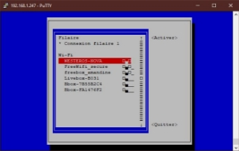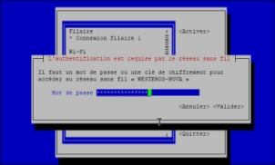

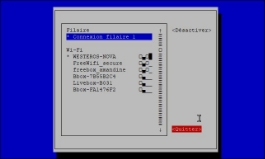

Vérifiez que le lien WIFI fonctionne via la commande `ifconfig` qui affichera les cartes réseau possédant une adresse IP. Celle qui nous intéresse est le lien «**wlan0**»

Avant de débrancher le câble Ethernet, via le navigateur se connecter à l’adresse IP «Wifi» (différente de celle en RJ45 car les adresses MAC des cartes réseau sont normalement différentes).

### Installation d'Octoprint

Pour installer Octoprint, nous devons d'abord créer un utilisateur à faible privilège, puis lui donner les droits minima requis pour exécuter Octoprint et se connecter à n'importe quel périphérique (imprimante, caméra, etc.).

1) Création de l’utilisateur «pi» :

`adduser pi`

2) Modifications des groupes de «pi» :

`usermod -a -G video, ssh, dialout, tty, sudo  pi`

3) On met un mot de passe à cet utilisateur (ici = **orangepi**) :

`passwd pi`
ou

`echo -e "orangepi\norangepi\n" | (passwd pi)`

4) Installation des paquets nécessaires :

`apt install python3-pip python3-dev python3-setuptools python3-venv git libyaml-dev build-essential ffmpeg`

Quelques vérifications :

`ls /home`

Le dossier «pi» doit appartenir à pi:pi (utilisateur: pi, groupe: pi)

4) A partir de maintenant les opérations seront réalisées en tant qu’utilisateur «pi» :

`su -u pi bash`
On vérifie qu’on est bien cet utilisateur :

`whoami`

Où est-on dans l’arborescence du système :

`pwd`

On doit normalement être dans le dossier personnel de «pi» : **/home/pi**. Si ce n’était pas le cas, se déplacer dans ce dossier perso :

`cd ~`

ou

`cd /home/pi`

On est dans un sous-shell pour cet utilisateur pi. Il reste à installer Octoprint. La [documentation](https://community.octoprint.org/t/setting-up-octoprint-on-a-raspberry-pi-running-raspbian-or-raspberry-pi-os/2337) écrite par @foosel (Gina  Häußge, l’autrice d’Octoprint), bien que prévue pour un Raspberry, indique les étapes à suivre.

1) Création du dossier accueillant Octoprint et déplacement dans celui-ci :

`mkdir OctoPrint && cd OctoPrint`

2) Passage en environnement virtuel pour Python :
```
python3 -m venv venv
source venv/bin/activate
```

3) Mise à jour de «pip» :

`pip install pip –upgrade`

4) Installation du paquet Python «Octoprint» :

`pip install octoprint`

5) Lancement du serveur :

`./OctoPrint/venv/bin/octoprint serve`

[Note de foosel à propos de l’environnement virtuel :

Un environnement virtuel n'est PAS une machine virtuelle. Considérez-le comme un dossier dédié au logiciel lui-même et à ses dépendances. Il n'y a pas de surcharge de ressources ici, à part une infime quantité de stockage supplémentaire pour certaines copies des binaires Python qui sont minuscules.]

Si tout s'est bien passé lors du lancement de la dernière commande, vous devez vous connecter via le navigateur de votre ordinateur à l’adresse: http://your.board.ip.address:5000 puis suivre les instructions de l'assistant de configuration.

Hello world, premier accès :

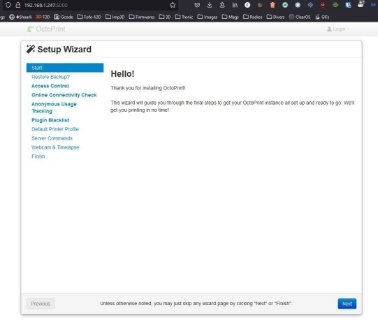

Si la page s’affiche, comme ci-dessus, tout est bon ;-)

Vous pouvez arrêter le serveur Octoprint dans la console en appuyant sur **Ctrl + C** et ensuite **Ctrl + D**, pour revenir au shell de l’utilisateur «root».

### Quelques «améliorations» (en tant que maître des lieux soit «root»)

**S'assurer qu'Octoprint démarre automatiquement lors du démarrage du système en ajoutant un service**:

On récupère sur le Github du projet Octoprint ce service et dans la foulée on le déplace à l’endroit adéquat:
```
wget https://github.com/OctoPrint/OctoPrint/raw/master/scripts/octoprint.service && mv octoprint.service /etc/systemd/system/octoprint.service
systemctl enable octoprint
systemctl start octoprint
```

Vérifiez que vous pouvez à nouveau vous connecter via votre navigateur, et si cela fonctionne, c'est presque terminé !

### Étapes supplémentaires pour se faciliter encore plus la vie

A) **Ajouter à Octoprint des «superpouvoirs»** (redémarrage automatique, arrêt du système, …). Pour cela, vous devez accorder certains privilèges à l'utilisateur pi. Vous ne voulez pas accorder des droits sudo complets à cet utilisateur car si un bogue ou un exploit se produisait dans Octoprint, votre système serait en danger. La meilleure solution ici est de n'accorder à l'utilisateur pi que les commandes sudo nécessaires.

Plutôt que modifier le fichier /etc/sudoers (à faire via «visudo»), on va ajouter deux fichiers dans le dossier /etc/sudoers,d/

1) Créer un fichier /etc/sudoers.d/octoprint-shutdown (en root) avec le contenu suivant :

`pi ALL=NOPASSWD: /sbin/shutdown` 
2) Créer un fichier /etc/sudoers.d/octoprint-service (en root) avec le contenu suivant :

`pi ALL=NOPASSWD: /usr/sbin/service` 

Une dernière commande concerne les droits de ces deux fichiers :

`chmod 0440 /etc/sudoers,d/\*`

B) Pouvoir utiliser une caméra

En «root» :

`apt install subversion libjpeg62-turbo-dev imagemagick ffmpeg libv4l-dev cmake`

En «pi» ( => **sudo -u pi bash**)
```
cd ~
git clone https://github.com/jacksonliam/mjpg-streamer.git
cd mjpg-streamer/mjpg-streamer-experimental
export LD_LIBRARY_PATH=.
make
```

Il ne devrait pas y avoir d’erreurs. Un test avec :

`./mjpg_streamer -i "./input_uvc.so" -o "./output_http.so"`

devrait retourner quelque chose du genre :
```
MJPG Streamer Version: svn rev:
` `i: Using V4L2 device.: /dev/video0
` `i: Desired Resolution: 640 x 480
` `i: Frames Per Second.: 5
` `i: Format............: MJPEG
[...]
` `o: www-folder-path...: disabled
` `o: HTTP TCP port.....: 8080
` `o: username:password.: disabled
` `o: commands..........: enabled
```
Si une caméra est connectée via le seul port USB, le navigateur pointé sur http://<OPiz2.IP>:8080/?action=stream  devrait afficher un flux vidéo.

Si c’est bon, on automatise le démarrage du serveur vidéo :

- créer un dossier nommé «scripts» dans le home de pi :

`mkdir /home/pi/scripts`

- créer un fichier dans /home/pi/scripts/  nommé webcamDaemon :

Soit via `touch /home/pi/scripts/webcamDaemon`

Soit, plus rapide : `>/home/pi/scripts/webcamDaemon`

- éditer ce fichier via nano en recopiant le contenu suivant :
```
#!/bin/bash

MJPGSTREAMER\_HOME=/home/pi/mjpg-streamer/mjpg-streamer-experimental
MJPGSTREAMER\_INPUT\_USB="input\_uvc.so"
MJPGSTREAMER\_INPUT\_RASPICAM="input\_raspicam.so"

\# init configuration
camera="auto"
camera\_usb\_options="-r 640x480 -f 10"
camera\_raspi\_options="-fps 10"

if [ -e "/boot/octopi.txt" ]; then
`    `source "/boot/octopi.txt"
fi

\# runs MJPG Streamer, using the provided input plugin + configuration
function runMjpgStreamer {
`    `input=$1
`    `pushd $MJPGSTREAMER\_HOME
`    `echo Running ./mjpg\_streamer -o "output\_http.so -w ./www" -i "$input"
`    `LD\_LIBRARY\_PATH=. ./mjpg\_streamer -o "output\_http.so -w ./www" -i "$input"
`    `popd
}

\# starts up the RasPiCam
function startRaspi {
`    `logger "Starting Raspberry Pi camera"
`    `runMjpgStreamer "$MJPGSTREAMER\_INPUT\_RASPICAM $camera\_raspi\_options"
}

\# starts up the USB webcam
function startUsb {
`    `logger "Starting USB webcam"
`    `runMjpgStreamer "$MJPGSTREAMER\_INPUT\_USB $camera\_usb\_options"
}

\# we need this to prevent the later calls to vcgencmd from blocking
\# I have no idea why, but that's how it is...
vcgencmd version

\# echo configuration
echo camera: $camera
echo usb options: $camera\_usb\_options
echo raspi options: $camera\_raspi\_options

\# keep mjpg streamer running if some camera is attached
while true; do
`    `if [ -e "/dev/video0" ] && { [ "$camera" = "auto" ] || [ "$camera" = "usb" ] ; }; then
`        `startUsb
`    `elif [ "`vcgencmd get\_camera`" = "supported=1 detected=1" ] && { [ "$camera" = "auto" ] || [ "$camera" = "raspi" ] ; }; then
`        `startRaspi
`    `fi

`    `sleep 120
done
```
- enregistrer ce fichier (CTRL+X en répondant Oui),

- rendre ce fichier exécutable via :

`chmod +x /home/pi/scripts/webcamDaemon`

- créer un fichier dans /etc/systemd/system/, nommé webcamd.service (**nano /etc/systemd/system/webcamd.service**) avec le contenu suivant :
```
[Unit]
Description=Camera streamer for OctoPrint
After=network-online-target OctoPrint.service
Wants=network-online.target

[Service]
Type=simple
User=pi
ExecStart=/home/pi/scripts/webcamDaemon

[Install]
WantedBy=multi-user.target
```
- Recharger les services :

`systemctl daemon-reload`

- Activer puis démarrer ce nouveau service :
```
systemctl enable webcamd
systemctl start webcamd
```

Pour pouvoir arrêter / démarrer ce service via Octoprint, il faut ajouter la section suivante dans le fichier config,yaml (dans le dossier caché .octoprint => **/home/pi/.octoprint/config.yaml**)
```
system:
`  `actions:
`   `- action: streamon
`     `command: sudo systemctl start webcamd
`     `confirm: false
`     `name: Start video stream
`   `- action: streamoff
`     `command: sudo systemctl stop webcamd
`     `confirm: false
`     `name: Stop video stream
```

### Rendre Octoprint accessible via le port 80 au lieu de 5000

Le mieux est d’utiliser «**haproxy**» en tant que proxy inverse plutôt que configurer Octoprint tournant sur le port 80. Pourquoi ?

- OctoPrint n'a pas besoin de s'exécuter avec les privilèges de l'utilisateur root, ce qui serait nécessaire pour pouvoir se lier au port 80 à cause des restrictions des ports privilégiés de Linux.

- Vous pouvez également rendre mjpg-streamer accessible sur le port 80.

- Vous pouvez ajouter l'authentification à OctoPrint.

- Selon la version de HAProxy, vous pouvez également utiliser SSL pour accéder à OctoPrint.

#### Installer haproxy :

`apt install haproxy`

- modifier le fichier de configuration /etc/haproxy/haproxy.cfg :
```
global
`        `maxconn 4096
`        `user haproxy
`        `group haproxy
`        `daemon
`        `log 127.0.0.1 local0 debug

defaults
`        `log     global
`        `mode    http
`        `option  httplog
`        `option  dontlognull
`        `retries 3
`        `option redispatch
`        `option http-server-close
`        `option forwardfor
`        `maxconn 2000
`        `timeout connect 5s
`        `timeout client  15min
`        `timeout server  15min

frontend public
`        `bind :::80 v4v6
`        `use\_backend webcam if { path\_beg /webcam/ }
`        `default\_backend octoprint

backend octoprint
`        `option forwardfor
`        `server octoprint1 127.0.0.1:5000

backend webcam
`        `http-request replace-path /webcam/(.\*)   /\1
`        `server webcam1  127.0.0.1:8080
```
Ainsi, Octoprint sera accessible via http://<Opiz2.IP>/ et le flux de la Webcam sera accessible via http://<Opiz2.IP>/webcam/

Pour que tout fonctionne, il faudra modifier le fichier /etc/default/haproxy en ajoutant la ligne ENABLED=1 (*ne semble plus une étape nécessaire*)

- activer puis lancer le service haproxy :
```
systemctl enable haproxy
systemctl start haproxy
```
Il restera à ajouter dans la configuration d’Octoprint les chemins d’accès dans la section «Caméra et Timelapses» (pour le flux : /webcam/?action=stream , pour les clichés : http://127.0.0.1:8080/?action=snapshot ).

### Dernières «améliorations» non indispensables mais probablement pratiques

La carte OPiz2 comme d’autres cartes d’OrangePi, possède un connecteur GPIO (deux en fait).

Armbian gère un peu différemment ces broches par rapport au Raspberry Pi.

Avec «Raspbian», les fichiers /dev/gpiochip0 (ou 1) appartiennent à root et au groupe gpio et ont pour droits crw-rw----- (0660)

Avec «Armbian», les fichiers /dev/gpiochip0 (ou 1) appartiennent à root et au groupe root et ont pour droits crw-------- (0600)

Pour fixer ceci et permettre qu’un éventuel greffon Octoprint utilisant les gpio fonctionne, il faut effectuer quelques modifications :

- créer un groupe gpio et ajouter l’utilisateur pi à celui-ci :
```
groupadd gpio
usermod -aG gpio pi
```
- vérifier que le groupe a bien été créé ainsi que ses membres :

`getent group | grep gpio`

- créer des régles UDEV avec les bonnes «ACLSs» :

`>/etc/udev/rules,d/96-gpio.rules` (ou `touch /etc/udev/rules,d/96-gpio.rules`)

- ajouter le contenu suivant via

`nano /etc/udev/rules,d/96-gpio.rules`

```
# /etc/udev/rules.d/96-gpio.rules
`      `SUBSYSTEM=="gpio\*", PROGRAM="/bin/sh -c '\
`         `chown -R root:gpio /sys/class/gpio && chmod -R 0770 /sys/class/gpio &&\
`         `chown -R root:gpio /sys/devices/platform/sunxi-pinctrl/gpio && chmod -R 0770 /sys/devices/platform/sunxi-pinctrl/gpio'"
`      `SUBSYSTEM=="gpio", GROUP="gpio", MODE="0660"
```
- sauvegarder le fichier précédent, et recharger ces règles UDEV :

`udevadm control –reload-rules && udevadm -trigger`

Si tout s’est bien déroulé, les droits et appartenances des périphériques «gpio» devraient être identiques à ceux d’un Raspberry :

```
pi@armbian:~$ ls -l /dev/gpiochip\*
crw-rw---- 1 root gpio 254, 0 Dec 28 19:16 /dev/gpiochip0
crw-rw---- 1 root gpio 254, 1 Dec 28 19:16 /dev/gpiochip1
```
Les greffons Octoprint faisant appel aux gpios devraient fonctionner à condition d’utiliser les bonnes déclarations (différentes d’un Rpi ;-) ), à vérifier sur le site du fabricant en fonction du modéle.

Pinout diagram de l’OPiz2 :

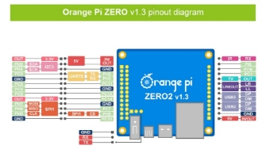

### Dernière «amélioration», pouvoir accéder au contenu du dossier «pi» d’un ordinateur du réseau

Cela n’a rien d’obligatoire mais c’est bien pratique. Pouvoir accéder au contenu du dossier «pi» via le protocole SAMBA, en tapant l’adresse IP de la carte dans l’explorateur (ex : \\192.168.1.247).

Pour cela, il faut ajouter quelques logiciels :

`apt install samba cifs-utils smbclient`

Ensuite modifier le fichier /etc/samba/smb.conf :

`nano /etc/samba/smb.conf`

Ajouter à la fin le contenu suivant :

```
[pi]
path =/home/pi
valid users = pi
read only = no
browseable = yes
```
Pour prendre en compte ces modifications :

```
systemctl reload smbd
systemctl status smbd
```
Ne pas oublier d’ajouter l’utilisateur «pi» à Samba en lui mettant un mot de passe («orangepi» identique à celui fixé précédemment mais il pourrait être différent, Windows le demandera à la première connexion sur le partage) :

`smbpasswd -a pi` (ou `echo -e "orangepi\norangepi\n" | (smbpasswd pi)` )

# CONCLUSION

Une fois toutes ces étapes réalisées, Octoprint est pleinement fonctionnel, en tout cas pour moi.

L’ajout de quelques greffons permet d’améliorer l’affichage :

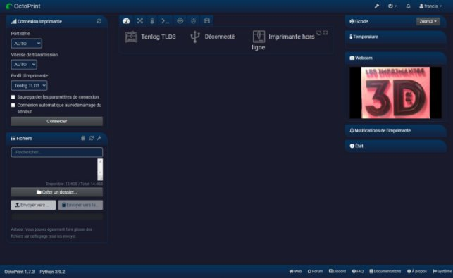

Une fois l’imprimante connectée en USB sur la carte OPiz2 (à noter que la Webcam ne s’affiche plus car je n’ai pas le Hat USB donc c’est comme au restaurant «fromage ou dessert» (le OU exclusif pour les amateurs de mathématiques)) :

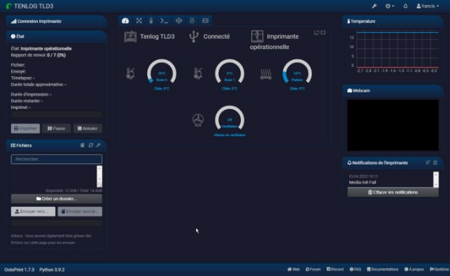

Les greffons ajoutés sont [UI customizer](https://github.com/LazeMSS/OctoPrint-UICustomizer), [Dashboard](https://github.com/j7126/OctoPrint-Dashboard), [Resource Monitor](https://github.com/Renaud11232/OctoPrint-Resource-Monitor), [Auto Login Config](https://github.com/OctoPrint/OctoPrint-AutoLoginConfig), [Multiple Upload](https://github.com/eyal0/OctoPrint-MultipleUpload).

En espérant que ce document pourra être utile à ceux voulant se lancer avec cette carte Orange Pi Zéro 2

:-)

