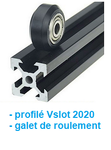
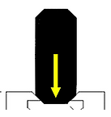
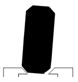
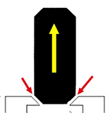
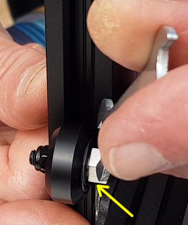
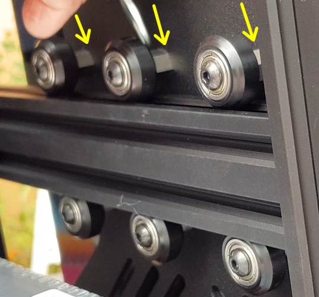
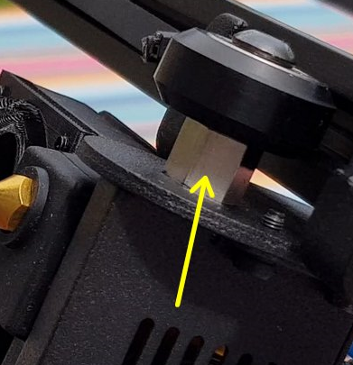

# Réglage des excentriques (profilés Vslot)

**Chaque partie mobile de l’imprimante est dotée d'excentriques sur au moins une roue de guidage**:

Les roues en V :

Celles-ci viennent s’appuyer sur la structure en V des rails (profilés Vslot):

Le profilé en aluminium extrudé est utilisé pour guider les différents “chariots” (les **parties mobiles**) des axes :

- la tête d'impression sur l'axe X,
- le lit chauffant sur l'axe Y,
- l'axe X avec la tête sur l'axe Z 

La roue vient en appui sur la partie en “V” du profilé. Les roues utilisées ont une forme adaptée à la rainure du profilé.

Ces roues sont constituées: 

- de bandes de roulement (la matière peut être de différentes «qualités» (Delrin, POM, Iglidur, …))
- de roulements à billes qui contribuent à diminuer les frottements
 
La qualité de ces roulements à billes peut parfois laisser à désirer et provoquer des surprises: «grognements» ou grippages.

En prévention, il peut être intéressant d’avoir quelques roues de guidage d’avance… Bien vérifier les dimensions de celle-ci avant d'en commander car plusieurs dimensions existent. ***Ne pas hésiter pas à les remplacer si on constate des points durs impossibles à supprimer lors des réglages***.

**Le bon réglage de l'appui de la roue sur le profilé est absolument nécessaire** pour éviter de :

- retransmettre tous les défauts du rail de guidage à l’impression,
- avoir des soucis de déplacement (frein, point dur).

Si la roue est insuffisamment plaquée contre le profilé, un interstice existe entre la roue et le profilé, ce qui entraînera un jeu préjudiciable à la qualité d’impression: 
> la partie mobile pourra se déplacer dans d'autres directions que celles voulues (jeu dans la tête d'impression, plateau «branlant», …)

 Trop plaquée
 Axe non perpendiculaire
 Pas assez plaquée

Ce qu'il faut arriver à régler, consiste à trouver le bon compromis (*ni trop, ni trop peu*)…
 
***Astuce*** :
> En faisant tourner manuellement la roue en train d'être réglée, elle doit pouvoir tourner à «*frottement gras*».
> Si elle **tourne librement** il faut **resserrer**, si elle **ne tourne pas manuellement** il faut **desserrer**… 
> Avec de la pratique, de l'entrainement, le «bon» réglage sera trouvé. L'expérience permettra d'acquérir ce toucher (feeling).

Le **réglage de l’excentrique** se fait avec une **clé plate** (10mm): tourner l’excentrique dans un sens ou l'autre (horaire / trigonométrique), permet d'approcher ou éloigner la roue du rail de guidage.

## Axe Z

Les chariots Z (tripodes), de chaque côté de la potence, supportant l'axe X (tête d'impression) ont chacun un excentrique :

## Axe Y

Le plateau (Y) comporte 2 ou 3 excentriques, en fonction de la taille du dit plateau, situés du même côté. Leur réglage permet à la fois de stabiliser le plateau et d'obtenir un déplacement en douceur, sans point dur:

## Tête d'impression

Le chariot de la tête d’impression (tripode) sur l'axe X comporte un excentrique situé dessous, du côté du plateau:

:smiley:
