# Comment formater les cartes microSD > 32 Go en FAT32 dans Windows 10 (7, 8 et 11 également)

Pour les cartes microSD de plus de 32 Go, Windows ne vous donne que l'option de formatage NTFS ou exFAT. Vous pouvez créer une petite partition (par exemple 4 Go) sur une carte microSD de taille supérieure (par exemple 64 Go) pour obtenir l'option de formatage FAT32.

- insérer la carte microSD dans le lecteur de carte du PC
- ouvrir le Gestionnaire de disques (par exemple Win+x pour ouvrir une liste de sélection, «Gestion des disques»)
  - Gestion des disques : supprimer toutes les partitions de la carte microSD
    - clic droit sur chaque partition > "Supprimer le volume…"
    - répéter jusqu'à ce qu'il n'y ait plus de partitions sur la carte
  - Gestion des disques : créer une nouvelle partition FAT32
    - clic droit sur "Non allouée" > "Nouveau volume simple…"
    - Bienvenue dans l'assistant Nouveau volume simple : cliquez sur "Suivant"
    - Spécifiez la taille du volume : 4096 > "Next" (Suivant)
    - Attribuer une lettre de lecteur ou un chemin d'accès : (au choix) > "Next" (Suivant)
    - Format Partition : Formater ce volume avec les paramètres suivants :
      - Système de fichiers : FAT32
      - Taille de l'unité d'allocation : Par défaut (16ko) 
      > Bien que plusieurs taille de cluster soient proposées, une partition de capacité supérieure à 8 Go
      > avec un choix de secteurs de 4ko conduira à un échec, le volume ne sera pas formaté et restera en «RAW»
      - Label du volume : à votre choix mais pas trop long
      - Effectuez un formatage rapide : ☑

Vous devriez maintenant avoir une partition FAT32 sur votre carte microSD.

**Exemple : Partition FAT32 de 4 Go sur une carte microSD de 64 Go**

Autre moyen de formater un support de stockage :

- ouvrir cmd avec des droits d'administrateur
  (Touche Windows+R, taper `cmd` dans la zone de recherche, clic droit pour lancer en mode administrateur)
- lancer `diskpart`
- on peut également lancer «directement «diskpart» :
  (Touche Windows+R, taper `diskpart` dans la zone de recherche, clic droit pour lancer en mode administrateur)
- taper `list disk` (liste des disques) ou `list volume` (liste des volumes)
- trouver la carte sd (exemple : Disque 6 ou volume 7)
- tape `select disk 6` (sélection du disque 6) ou `select volume 7` (sélection du volume 7)
- lister les partitions du disque `list partition`
- s'il n'y a qu'une seule partition - taper `select partition 1`. S'il y en a plusieurs, supprimez toutes les partitions et créez-en une ( `create partition primary size=16384` pour créer une partition de 16 Go (16384 Mo).
- Tapez `format FS=FAT32  QUICK` (on peut préciser la taille du cluster avec UNIT=valeur MAIS Windows n’accepte pas de secteur de 4 ko avec le format FAT32 au-delà de 8 Go).
- c'est fait. Partition de 16 Go en FAT32 sur une carte de plus grande capacité. 

## En images :

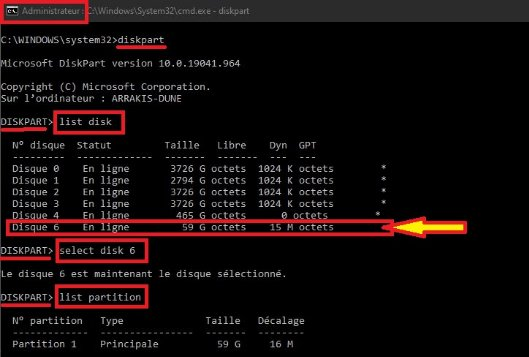

Liste des disques (bien choisir le «bon»)

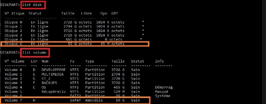

Liste des disques ou des volumes

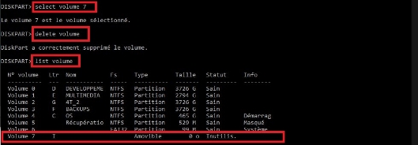

### Suppression du volume sélectionné

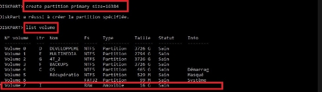

### Création d’une partition

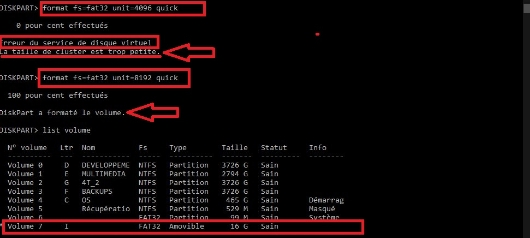

Formatage de la partition (impossible d’utiliser des secteurs de 4096 octets)

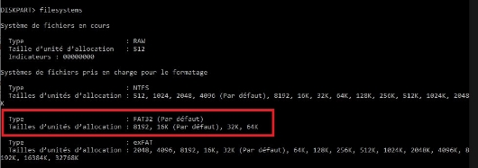

Liste des systèmes de fichiers disponibles et leurs capacités

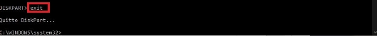

Quitter Diskpart

## Résultat :

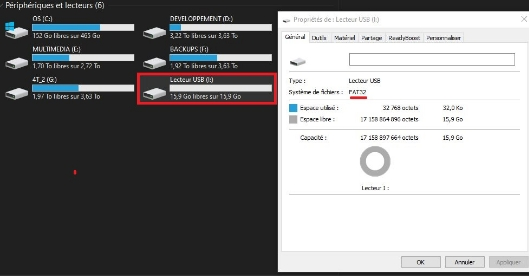

> **Même en passant par la ligne de commande, on ne peut formater directement en FAT32 une partition
> supérieure à 8 Go avec une sectorisation en 4096 octets (la taille de secteur par défaut est de 16 ko.)**

Plus d’informations sur Diskpart : [ici](https://www.commentcamarche.net/informatique/windows/25031-diskpart-gerer-les-disques-et-partitions-windows/) ou [là](https://docs.microsoft.com/fr-fr/windows-server/administration/windows-commands/diskpart).

**Pour pouvoir formater une carte SD (μSD) ou une clé USB (ou un disque dur) de plus de 32 Go avec une sectorisation de 4096 octets (4 ko)**, on peut le faire mais il faut passer par un outil externe, par exemple [AOMEI Partition Assistant](https://www2.aomeisoftware.com/download/pa/PAssist_Std.exe) en version «free» ou payante, la version freeware est suffisante avec des publicités ou des rappels réguliers à passer à une version payante.

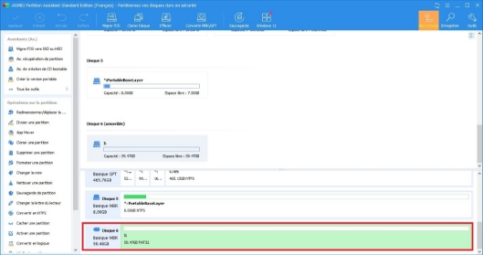

Sélectionner le disque à formater, puis un clic droit et choisir l’option «formater le disque»

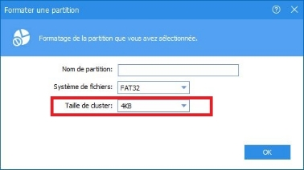

Choisir le système de fichiers et la taille de sectorisation (cluster), là on peut choisir 4ko, valider par OK
Cliquer sur l’opération en attente => Appliquer

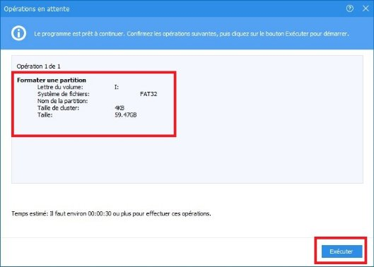 

Lire le récapitulatif puis cliquer «Exécuter»

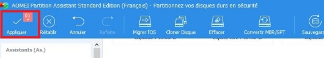

Appliquer les modifications

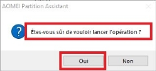

Confirmer

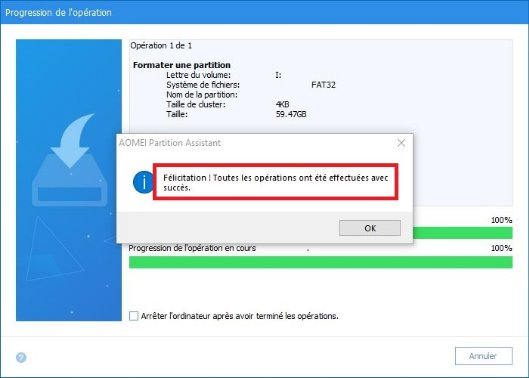

Après un certain temps, le formatage est terminé

### Résultat dans l’explorateur :

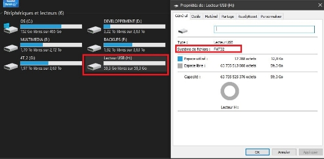

:smiley:

