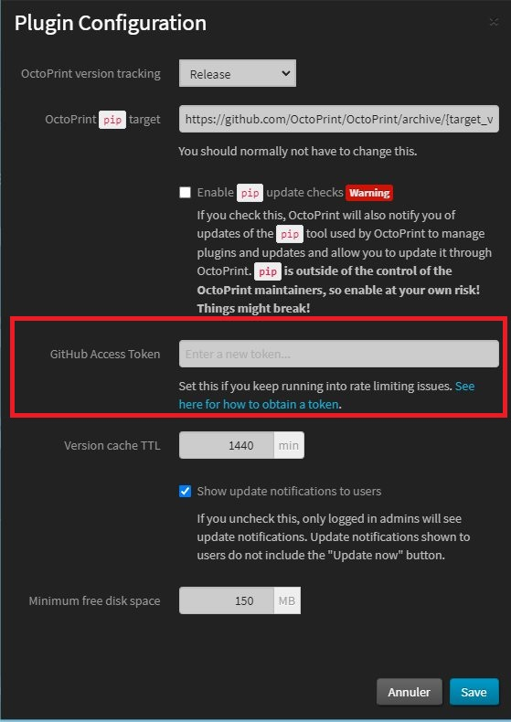
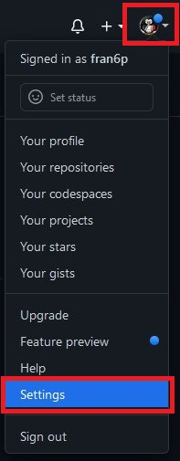
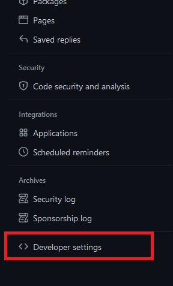
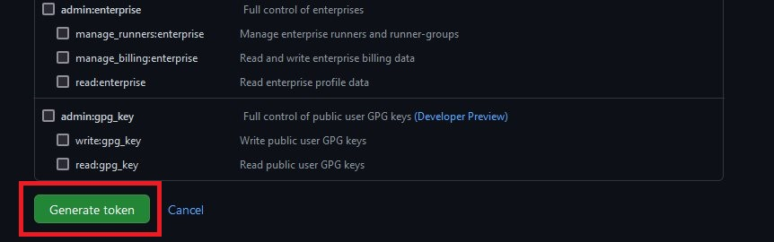
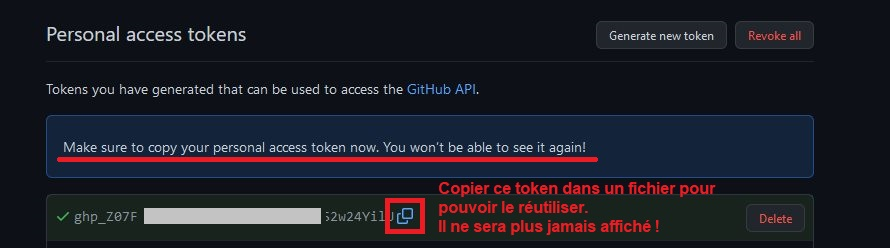

# Passer outre les limites de connexions lors d'une mise à jour Octoprint

L'ensemble des mises à jour Octoprint (base et/ou extensions) passe par Github qui limite le nombre de connexions possibles sur une période de temps donné.

Ayant plusieurs matériels (Raspberry Pi (3B, 3B+, 4B, Zero 2, RPI400…) et une OrangePi Zero 2), j'avais régulièrement des impossibilités de mettre à jour l'ensemble de mes matériels à cause de cette limitation. 

**La solution nécessite d'avoir un compte Github et de se créer un «Personal Access Token».**
 
Avant la version 1.8.0 d'Octoprint (1.7.3), il fallait ensuite manuellement aller «bidouiller» le fichier `config.yaml` en ajoutant dans la section «`softwareupdate`», deux lignes (*en mettant évidemment les bonnes indentations* (***pas de tabulation mais 2 / 4 espaces***) :

 >     credentials:
 >       github: ghp_KqhX......hAbmZ......ENhi......NlhdW-
 
 Comme ci-dessous :
 
 
 
Il suffisait ensuite de copier le token recopié du site Github dans la ligne «`github: `», de redémarrer Octoprint pour ne plus être limité lors de mises à jour :smirk:

Avec la version 1.8.0, cette section «`credentials`» est désormais présente dans le fichier `config.yam/l`. Il suffit de se créer un «personal access token» via son propre compte Github et de copier sa valeur via l'interface d'Octoprint (`Software Update > Settings ` (**l'icone représenté par une «clé»**)) dans la ligne `Github Acces Token` puis de sauvegarder pour que cette modification soit prise en compte :smiley:

# Créer un Personal Access Token

 1 Se connecter avec son compte sur Github.
 
 2 Accéder aux paramètres du compte :
 
 
 
 3 Accéder aux options dédiées aux développeurs :
 
 
 
 4 Sélectionner l'option «Personal access tokens» :
 
 
 
 5 Générer un nouveau token en cliquant sur le bouton :
  
 
 
 6 Compléter a minima le champ «Note» en lui donnant un nom explicite, une date d'expiration (choix dans la liste), sur quoi le token pourra agir (scopes):
  
 
  
 7 Valider pour générer le token :
  
 
  
 8 Une fois celui-ci généré, le copier (et coller dans un fichier texte en sauvegarde car on ne pourra plus le réafficher) et le coller l§ où on l'utilisera (fichier `config.yaml` ou champ de saisie directement dans Octoprint si version ⩾ 1.8.0 :
  
 
 
 # :smiley:
  
